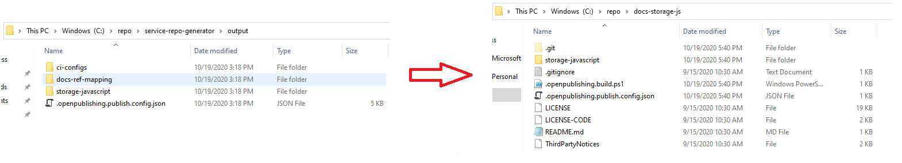

## Walk-through - Creating a Service Oriented Documentation Repository

This walkthroough assumes understanding of the docs CI process. 

### Pre-Reqs
To begin, establish the following configuration.

1. What service are you dealing with?
2. What are the major versions of the packages you want to document?

Given the known information, begin by creating a new `docset` in [OPS.](ops.microsoft.com)

After that, establish which major versions of the SDK need to be present in the drop down.

TODO: Image of dropdown populated from docs-storage-java

This is necessary because the same package cannot exist multiple times in the same `moniker`. A `moniker` is merely unit of publishing work for the docs system. They allow us to differentiate different versions of the _same path_ on docs.microsoft.com.

#### Creating a DocSet

To create a docset, follow [these instructions](https://review.docs.microsoft.com/en-us/help/onboard/setup?branch=master). As you follow this tutorial, ensure the following.

 - The doc repo is created under the `Azure` organization.
 - The notification receiver includes this email: `azuresdkdocreview@microsoft.com`

Throughout this document, examples will be sourced from this [documentation repository](https://github.com/azure/docs-storage-java). The docset name is [storage-java](https://github.com/Azure/docs-storage-java/blob/cab37c290bac2b1422810e6ede0d8bb1a9ce4d9e/.openpublishing.publish.config.json#L4)

#### Creating Monikers

This [document](https://review.docs.microsoft.com/en-us/help/onboard/admin/reference/concepts/monikers?branch=master#creating-monikers) has good information on the creation and care of `monikers`.


### Using the service repo generator

After creating the doc set, there will exist a documentation repository initialized with a basic publication configuration. We will immediately overwrite this with contents from the `service-repo-generator`. 

First, clone the repo generator:

`git clone https://github.com/scbedd/service-repo-generator.git`

then, clone down the newly created documentation repo.

`git clone https://github.com/Azure/<doc repo>.git` 

After that, the `README.md` at the root of the repo will show you how to install and invoke. 

Here is a copy of the configuration the `service-repo-generator` utilizes. Feel free to use this as a template when populating. There are examples for each language in the [example_repo_configurations](https://github.com/scbedd/service-repo-generator/tree/main/example_repo_configurations) folder.

```
{
    "docset_name": "<pulled from docset creation process>", 
    "docset_base_path": "<language>",
    "monikers": [
        "<moniker1>","<moniker2>","<monikerN>"
    ],
    "language": "<target language>",
    "lang": "<target 'shortened' language. javascript = js. dotnet = C#. java = java. python = python.>",
    "service_label": "<target service>",
    "target_doc_repo": "<name of the doc repo created with your docset>"
}
```

The key here. Prior to commiting your generated publishing config to the doc repo, esnure that our target docset and monikers ALREADY EXIST.

Once you've updated `repo_configuration.json` at the root of the `service-generator-repo`. Follow the [service generator readme](../README.md) to generate your templates into the `output` folder.

Grab everything under `output` and place into your doc repo. 

`scbedd` uses the following pshell command, but you're welcome to use `File Explorer` to do the same thing.

```powershell

Copy-Item -Path "C:/repo/service-repo-generator/*" -Destination "C:/repo/docs-storage-js/" -Recurse -F

```



### Updating CI Targeting


This [folder](https://github.com/scbedd/service-repo-generator/tree/main/ci-config-examples) contains example ci-configurations for each language.

Populate each moniker's configuration file with the appropriate packages. For most of this document, the repo `docs-storage-java` has been utilized. In that specific case, there are _two_ monikers at play. 

- Version 12.X.X
- Version 10.X.X

### Standing Up CI

In the standard docs CI world. There would be a CI job per moniker. Each of these jobs would push to a separate branch, and doc owners would need to merge each branch into `master` manually to combine their output.

This doesn't work so well at scale. As a result, we have a set of [template jobs](https://apidrop.visualstudio.com/Content%20CI/_build?definitionScope=%5CTemplates%5CAzure-SDK) that pull their targeting configuration 
from the documentation repository itself.

Each job will generate documentation for all onboarded monikers. There is a bit of manual effort here though. As part of the service-repo generation, a `ci-configs` folder will be created. Each configuration is utilized outputs for a single moniker.

TODO: walk through updating CI. Can we script this?